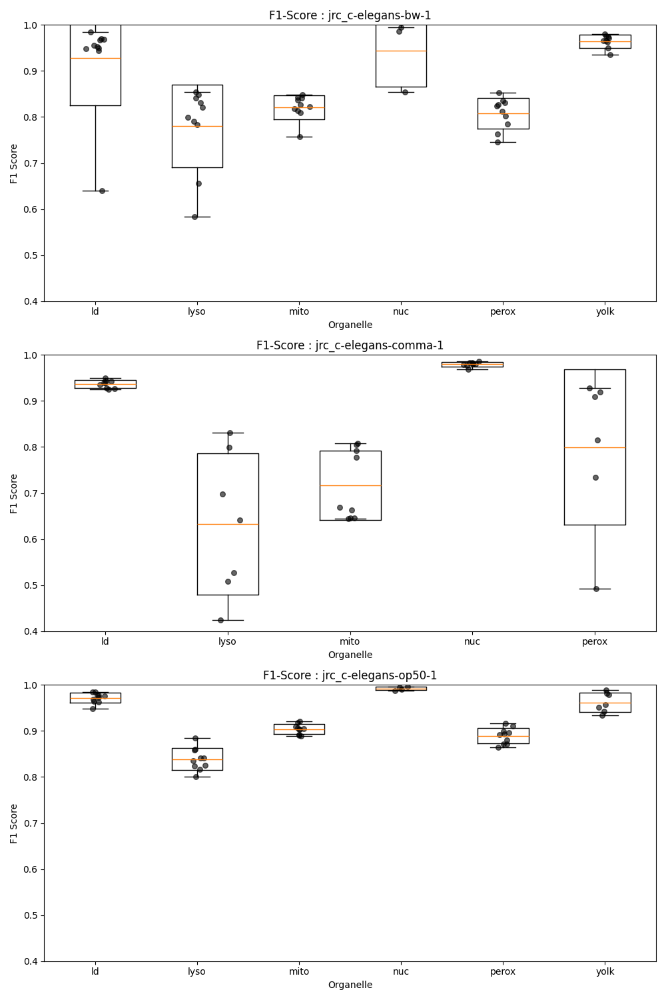

# info:

Full scores are in `instances_scores.json` and `semantic_scores.json`

Script used is `generate_scores.py`

------

# Scores: 
## semantic scores  - F1 score :
### jrc_c-elegans-bw-1:
    mito: 0.841
    ld: 0.968
    lyso: 0.790
    perox: 0.824
    nuc: 0.995
    yolk: 0.972
### jrc_c-elegans-comma-1:
    mito: 0.805
    ld: 0.940
    lyso: 0.698
    perox: 0.919
    nuc: 0.984
    yolk: nan
### jrc_c-elegans-op50-1:
    mito: 0.907
    ld: 0.977
    lyso: 0.836
    perox: 0.894
    nuc: 0.994
    yolk: 0.989

## instance scores - accuracy (using cellmap challenge evaluation code):
### jrc_c-elegans-bw-1:
    mito: 0.984
    ld: 0.993
    lyso: 0.999
    perox: 0.999
    nuc: 0.997
    yolk: 0.968
### jrc_c-elegans-comma-1:
    mito: 0.968
    ld: 0.985
    lyso: 1.000
    perox: 0.993
    nuc: 0.996
    yolk: 1.000
### jrc_c-elegans-op50-1:
    mito: 0.985
    ld: 0.996
    lyso: 0.999
    perox: 0.999
    nuc: 0.997
    yolk: 0.999

